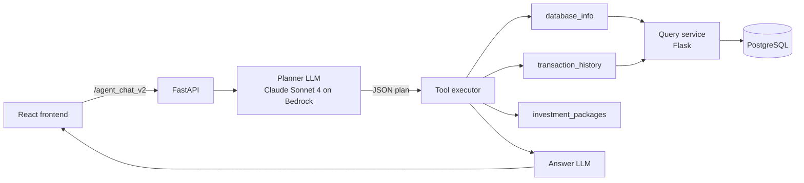

# FinAI — LLM agent for personalized investment advice

A banking assistant that answers questions about a client's finances by **planning tool calls over a PostgreSQL database** and recommending investment packages matched to the client's risk category. Built by team **Skepya** at the **NEXXT AI Hackathon 2025**.

## Problem

Banks give clients plenty of data (transactions, product lists, charts) but little guidance on what actually fits their situation and risk tolerance.

## How it works

The backend (FastAPI) runs a **plan → execute → answer** agent on **Claude Sonnet 4 via AWS Bedrock**:

1. **Planner.** The LLM returns a strict-JSON plan of 0–3 tool calls (`database_info`, `transaction_history`, `investment_packages`, or `skip`), with a short reason and a confidence score.
2. **Executor.** Steps run sequentially, with placeholder resolution between them. For example, `{{database_info.risk_profile}}` feeds the client's risk category into the package lookup.
3. **Answerer.** A second LLM call writes the final reply, using all tool outputs as context.



**Natural language → SQL (`/prompt`).** The model writes a single SQL query, and the backend enforces safety before running it:
- only `SELECT`/`WITH` statements are accepted;
- dangerous keywords and multiple statements are blocked;
- a `LIMIT` is appended when missing;
- the query runs in a read-only transaction with a 5-second statement timeout.

**Risk classifier prototype** (`RiskScoreClassifier.ipynb`) is a scikit-learn pipeline:
- preprocessing: median imputation and scaling for numeric features, one-hot encoding for categorical ones;
- model: Random Forest;
- data: the Kaggle *Financial Risk Assessment* dataset, 5,716 rows after dropping missing values;
- target: 3 classes (Low / Medium / High).

## Results

Random Forest (100 trees), test set of 1,144 clients:

| Class | Precision | Recall | F1 | Support |
|---|---|---|---|---|
| Low | 0.61 | 0.96 | 0.75 | 706 |
| Medium | 0.25 | 0.03 | 0.05 | 335 |
| High | 0.00 | 0.00 | 0.00 | 103 |
| **Accuracy** | | | **0.60** | 1,144 |
| **Macro avg** | 0.29 | 0.33 | 0.27 | 1,144 |

The classes are imbalanced (62% of clients are "Low" risk), and the model ends up predicting almost only that class: it never identifies a "High"-risk client. For this reason the classifier is not used by the agent, which relies on the risk category stored for each client instead.

The classifier does **not** beat the majority baseline. It predicts "Low" almost always, with recall 0.00 on "High". The features in this dataset carry very little signal for the label, so the model is not used by the agent. The agent relies on the risk category stored for each client instead. Takeaway: always compare against a trivial baseline before building on top of a model.

## Tech stack

**Backend:** Python, FastAPI, AWS Bedrock (Claude Sonnet 4), PostgreSQL 16, Flask, Docker Compose, scikit-learn
**Frontend:** React, TypeScript, Vite, Tailwind CSS, Recharts, three.js

## How to run

```bash
cd backend/fastapi_web
cp .env.example .env        # fill in your AWS Bedrock credentials
cd ..
docker compose up --build   # Postgres :5432, query API :8080, agent API :8090
curl localhost:8090/health
```

```bash
cd frontend
npm install
npm run dev
```

> The schema and seed data for the `clients` and `transactions` tables are not in the repo yet (see below).

## What I'd improve

- **Real data layer.** The `database_info` tool is currently stubbed and returns the default category. It should use the existing `build_sql_client_risk` query. `init.sql` should also contain the schema and seed data for `clients` and `transactions`.
- **Risk model.** Start from baselines, report macro-F1, and try class weighting. Better still, use a dataset with real signal.
- **Planner evaluation.** Build a small test set of questions with their expected tool plans, to measure how often the planner picks the right tools.
- **Voice features.** Move the OpenAI speech-to-text and text-to-speech calls behind the backend, so no API key ships to the browser. `ChatAI.tsx` also references an undefined `apiKey`.
- **Code hygiene.** Remove the old `main1.py` / `main2.py`. Add unit tests for `_sanitize_sql` and the placeholder resolver.

## My contribution

Team Skepya. My parts:

- **Risk classifier and evaluation:** built the scikit-learn pipeline (imputation, scaling, one-hot encoding, Random Forest) and evaluated it against a majority-class baseline. The model does not beat the baseline on this dataset (accuracy 0.60 vs 0.62, macro-F1 0.27 vs 0.25), so the agent relies on the risk category stored for each client instead.
- **Agent**, together with Rareș Roșcan: the plan → execute → answer flow. This covers the tool definitions, tool calling (a JSON plan from the planner, executed step by step with placeholders passing results between tools) and generating the final answer from the tool outputs.
